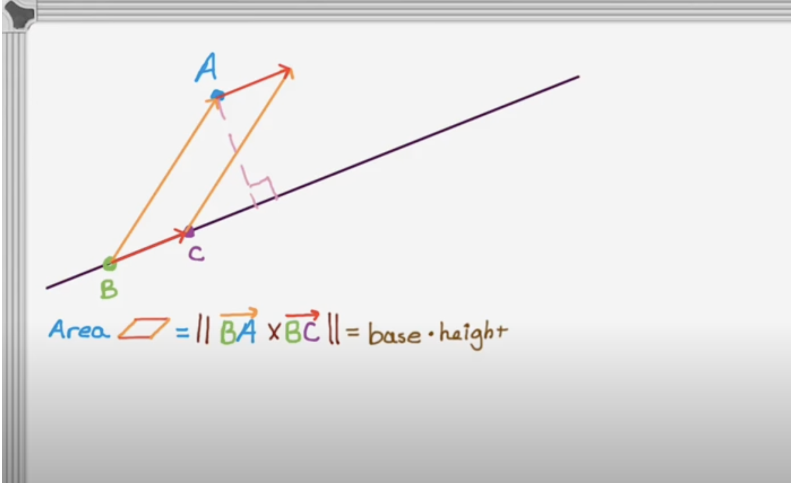

# Perpendicular distance from a point to a line


## 使用cross product

一、youtube [Cross Product and Distance from a Point to a Line](https://www.youtube.com/watch?v=tYUtWYGUqgw)




二、CSDN [向量叉积(Cross product)的几何意义及应用](https://blog.csdn.net/minmindianzi/article/details/100056129)

三、stackoverflow [Distance Between a point to a line formed by two points](https://stackoverflow.com/questions/75577663/distance-between-a-point-to-a-line-formed-by-two-points) # [A](https://stackoverflow.com/a/75577747)

四、stackexchange [Distance between a point and a line (defined by 2 points)](https://math.stackexchange.com/questions/2757318/distance-between-a-point-and-a-line-defined-by-2-points) # [A](https://math.stackexchange.com/a/2757330)


四、https://cplusplus.com/forum/general/87903/

```c++
double Detection::distance_to_Line(cv::Point line_start, cv::Point line_end, cv::Point point)
{
	double normalLength = _hypot(line_end.x - line_start.x, line_end.y - line_start.y);
	double distance = (double)((point.x - line_start.x) * (line_end.y - line_start.y) - (point.y - line_start.y) * (line_end.x - line_start.x)) / normalLength;
	return distance;
}
```

## 使用dot product


一、brilliant [Dot Product - Distance between Point and a Line](https://brilliant.org/wiki/dot-product-distance-between-point-and-a-line/)	

这个的解释非常好

二、rosettacode [Ramer-Douglas-Peucker line simplification](https://rosettacode.org/wiki/Ramer-Douglas-Peucker_line_simplification#C++)


