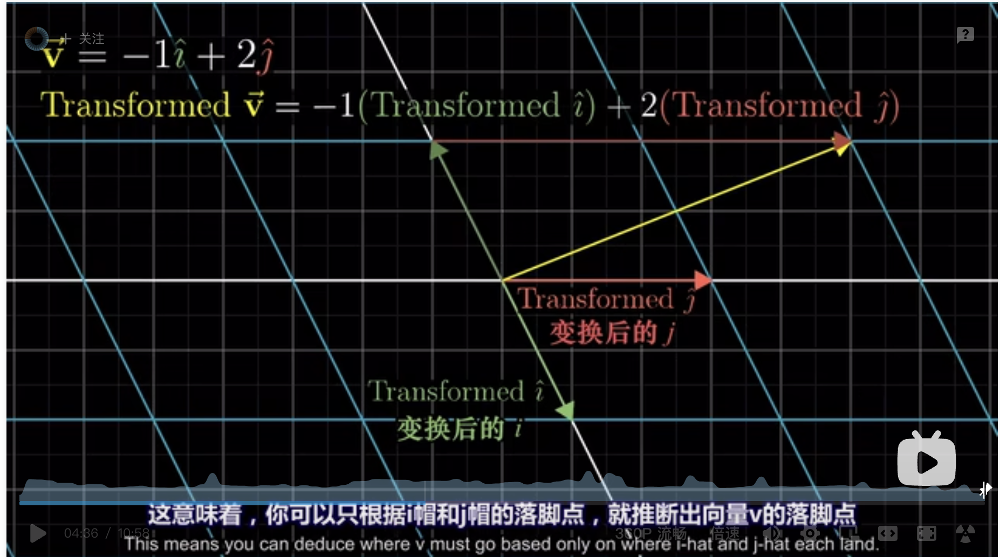
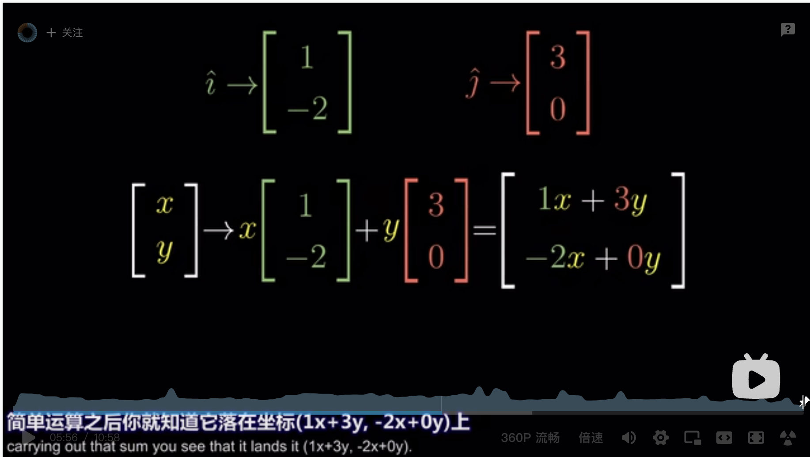
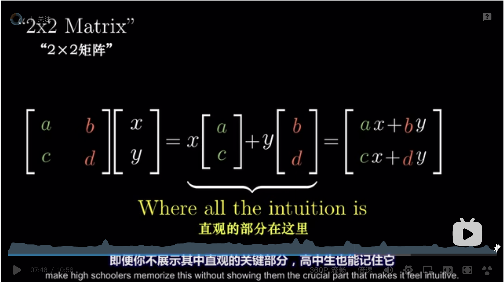

# Linear transformations and matrices | Chapter 3, Essence of linear algebra

https://www.youtube.com/watch?v=kYB8IZa5AuE&list=PLZHQObOWTQDPD3MizzM2xVFitgF8hE_ab&index=3

https://www.bilibili.com/video/BV1ns41167b9/?spm_id_from=333.788.recommend_more_video.-1

If I had to choose just one topic that makes all of the others in linear algebra start to click and which too often goes unlearned the first time a student takes linear algebra, it would be this one: the idea of a **linear transformation** and its relation to matrices.

> NOTE:
>
> 一、翻译如下:
>
> 如果要我选出一个主题，它不仅让线性代数的其他内容一目了然 又经常被初次学习线性代数的人忽视 我会选择这个——线性变换的概念以及它和矩阵的关系

For this video, I'm just going to focus on what these transformations look like in the case of two dimensions and how they relate to the idea of **matrix-vector multiplication**. In particular, I want to show you a way to think about **matrix-vector multiplication** that doesn't rely on memorization.

> NOTE:
>
> 一、翻译如下:
>
> 这些变换在二维空间中长什么样 以及它们如何与矩阵向量乘法关联 尤其是展示一种不用死记硬背的考虑矩阵向量乘法的方法
>

## linear transformation

To start, let's just parse this term “linear transformation”. “Transformation” is essentially a fancy word for “function”. It's something that takes in inputs and spits out an output for each one. Specifically in the context of linear algebra, we like to think about **transformations** that take in some **vector** and spit out another **vector**.

> NOTE:
>
> 一、翻译如下:
>
> 首先，我们先来解析“线性变换”这个术语 “变换”本质上是“函数”的一种花哨的说法 它接收输入内容，并输出对应结果
>
> 二、在linear algebra中，**transformations**的输入和输出都是vector

So why use the word “transformation” instead of “function” if they mean the same thing?  Well, it's to be suggestive of a certain way to visualize this input-output relation. You see, a great way to understand functions of vectors is to use movement. If a transformation takes some input vector to some output vector, we imagine that input vector moving over to the output vector.

> NOTE:
>
> 一、上面这段话提出了 "movement"，结合视频内容可以看出，transformation本质上是movement

Then to understand the transformation as a whole, we might imagine watching every possible input vector move over to its corresponding output vector.

It gets really crowded to think about all of the vectors all at once, each one is an arrow, So, as I mentioned last video, a nice trick
is to conceptualize each vector, not as an arrow, but as a single point: the point where its tip sits.

That way to think about a transformation taking every possible **input vector** to some **output vector**, we watch every point in space moving to some other point. In the case of **transformations** in two dimensions, to get a better feel for the whole “shape” of the transformation, I like to do this with all of the points on an infinite grid. I also sometimes like to keep a copy of the grid in the background, just to help keep track of where everything ends up relative to where it starts.

The effect for various transformations, moving around all of the points in space, is, you've got to admit, beautiful. It gives the feeling of squishing(压扁) and morphing(变形) space itself. As you can imagine, though arbitrary transformations can look pretty complicated, but luckily linear algebra limits itself to a special type of transformation, ones that are easier to understand, called “linear” transformations. Visually speaking, a transformation is linear if it has two properties:

1、all lines must remain lines, without getting curved,

2、and the origin must remain fixed in place.

For example, this right here would not be a **linear transformation** since the lines get all curvy and this one right here, although it keeps the line straight, is not a linear transformation because it moves the origin.

This one here fixes the origin and it might look like it keeps line straight, but that's just because I'm only showing the horizontal and vertical grid lines, when you see what it does to a diagonal line(对角线), it becomes clear that it's not at all linear since it turns that line all curvy.

In general, you should think of linear transformations as keeping grid lines parallel and evenly spaced. 

> NOTE:
>
> 一、意思是: "保持网络格平行并且等距分布"，显然这是经验之谈

Some linear transformations are simple to think about, like rotations about the origin. Others are a little trickier to describe with words.

## describe transformations numerically

So how do you think you could describe these transformations numerically? If you were, say, programming some animations
to make a video teaching the topic what formula do you give the computer so that if you give it the coordinates of a vector, it can give you the coordinates of where that vector lands?

It turns out that you only need to record where the two **basis vectors**, i-hat and j-hat, each land.  and everything else will follow from that.

> NOTE:
>
> 一、在对basis vector执行线性变换后，由basis vector所span的所有的vector都做相同的线性变化，后面会有例子证明

For example, consider the vector v with coordinates (-1,2), meaning that it equals -1 times i-hat + 2 times j-hat. If we play some transformation and follow where all three of these vectors go, the property that grid lines remain parallel and evenly spaced has a really important consequence: the place where v lands will be -1 times the vector where i-hat landed plus 2 times the vector where j-hat landed. In other words, it started off as a certain linear combination of i-hat and j-hat and it ends up is that same linear combination of where those two vectors landed. This means you can deduce where v must go based only on where i-hat and j-hat each land. This is why I like keeping a copy of the original grid in the background;

> NOTE:
>
> 一、翻译如下:
>
> 比如说，考虑坐标为(-1, 2)的向量v，这个向量就是-1与i帽之积和2与j帽之积的和。如果我们运用一些变换，并且跟随这三个向量的运动，网格线保持平行且等距分布的性质有一个重要的推论: 变换后的向量v的位置，是-1与变换后的i帽之积，加上2与变换后的j帽之积
>
> 换句话说，向量v是i帽和j帽的一个特定线性组合，那么变换后的向量v也是变换后i帽和j帽的同样的线性组合，这意味着，你可以只根据变换后的i帽和j帽，就推断出变换后的v，这也是为什么我喜欢在背景中保留原始网格的副本。

for the transformation shown here we can read off that i-hat lands on the coordinates (1,-2). and j-hat lands on the x-axis over at the coordinates (3, 0). This means that the vector represented by (-1) i-hat + 2 times j-hat ends up at (-1) times the vector (1, -2) +
2 times the vector (3, 0). Adding that all together, you can deduce that it has to land on the vector (5, 2). 

This is a good point to pause and ponder, because it's pretty important.

Now, given that I'm actually showing you the full transformation, you could have just looked to see the v has the coordinates (5, 2), but the cool part here is that this gives us a technique to deduce where any vectors land, so long as we have a record of where i-hat and j-hat each land, without needing to watch the transformation itself.

Write the vector with more general coordinates `x` and `y`, and it will land on x times the vector where i-hat lands (1, -2), plus y times the vector where j-hat lands (3, 0). Carrying out that sum, you see that it lands at (1x+3y, -2x+0y). I give you any vector, and you can tell me where that vector lands using this formula. 

What all of this is saying is that a two dimensional **linear transformation** is completely described by just four numbers: 

the two coordinates for where i-hat lands and the two coordinates for where j-hat lands. 

Isn't that cool?

it's common to package these coordinates into a two-by-two grid of numbers, called a two-by-two matrix, where you can interpret the columns as the two special vectors where i-hat and j-hat each land.

If you're given a two-by-two matrix describing a linear transformation and some specific vector and you want to know where that linear transformation takes that vector, you can take the coordinates of the vector multiply them by the corresponding columns
of the matrix, then add together what you get. This corresponds with the idea of adding the scaled versions of our new basis vectors.

Let's see what this looks like in the most general case where your matrix has entries a, b, c, d and remember, this matrix is just a way of packaging the information needed to describe a linear transformation. Always remember to interpret that first column,
(a, c), as the place where the first basis vector lands and that second column, (b, d), is the place where the second basis vector lands. When we apply this transformation to some vector (x, y), what do you get? Well, it'll be x times (a, c) plus y times (b, d). Putting this together, you get a vector (ax+by, cx+dy). You can even define this as matrix-vector multiplication when you put the matrix on the left of the vector like it's a function.

Then, you could make high schoolers memorize this, without showing them the crucial part that makes it feel intuitive.

But, isn't it more fun to think about these columns as the transformed versions of your basis vectors and to think about the results as the appropriate linear combination of those vectors?

Let's practice describing a few linear transformations with matrices.

## example

For example, if we rotate all of space 90° counterclockwise then i-hat lands on the coordinates (0, 1) and j-hat lands on the coordinates (-1, 0). So the matrix we end up with has columns (0, 1), (-1, 0). To figure out what happens to any vector after
90° rotation, you could just multiply its coordinates by this matrix.

Here's a fun transformation with a special name, called a “shear”. In it, i-hat remains fixed so the first column of the matrix is (1, 0), but j-hat moves over to the coordinates (1,1) which become the second column of the matrix.

And, at the risk of being redundant here, figuring out how a shear transforms a given vector comes down to multiplying this matrix by that vector.

## What about go the other way around

Let's say we want to go the other way around, starting with the matrix, say with columns (1, 2) and (3, 1), and we want to deduce what its transformation looks like.

Pause and take a moment to see if you can imagine it.

One way to do this is to first move i-hat to (1, 2). Then, move j-hat to (3, 1). Always moving the rest of space in such a way that keeps grid lines parallel and evenly spaced. 

## linearly dependent

If the vectors that i-hat and j-hat land on are **linearly dependent** which, if you recall from last video, means that one is a scaled version of the other. It means that the linear transformation squishes all of 2D space on to the line where those two vectors sit, also known as the one-dimensional span of those two linearly dependent vectors.

## summary

To sum up, **linear transformations** are a way to move around space such that the grid lines remain parallel and evenly spaced and such that the origin remains fixed. Delightfully, these transformations can be described using only a handful of numbers.

The coordinates of where each basis vector lands. Matrices give us a language to describe these transformations where the columns represent those coordinates and matrix-vector multiplication is just a way to compute what that transformation does to a given vector.

The important take-away here is that, every time you see a matrix, you can interpret it as a certain transformation of space.

Once you really digest this idea, you're in a great position to understand linear algebra deeply. Almost all of the topics coming up, from matrix multiplication to determinant, change of basis, eigenvalues, ... all of these will become easier to understand once you start thinking about matrices as transformations of space.

Most immediately, in the next video I'll be talking about multiplying two matrices together. See you then!
